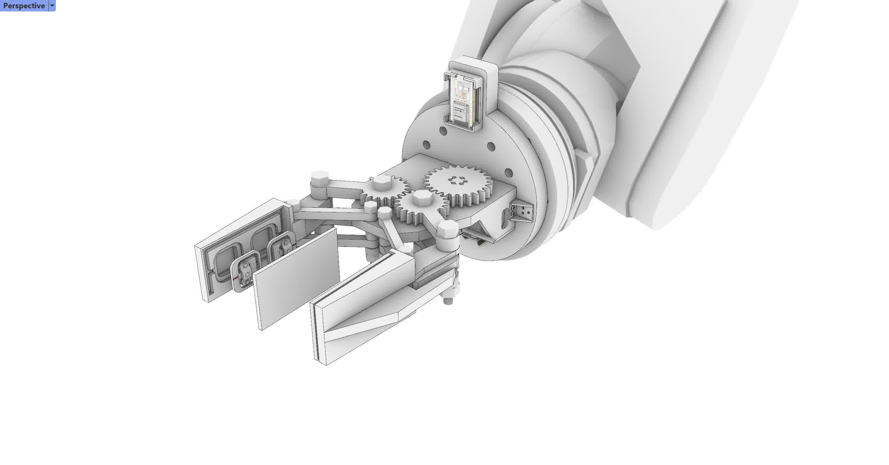
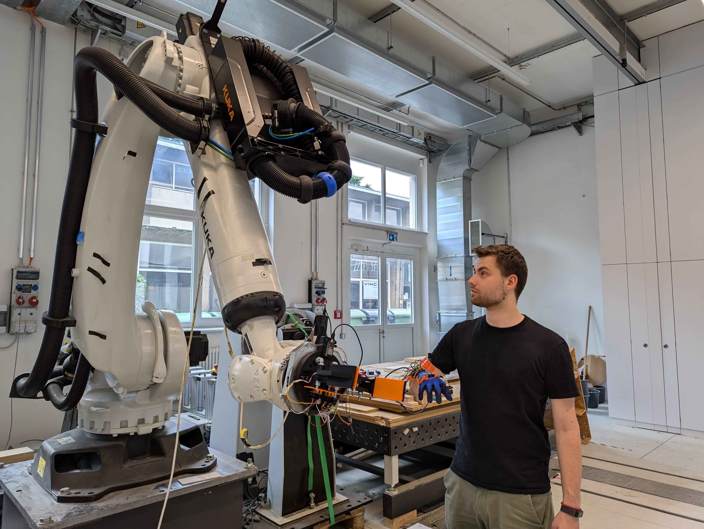
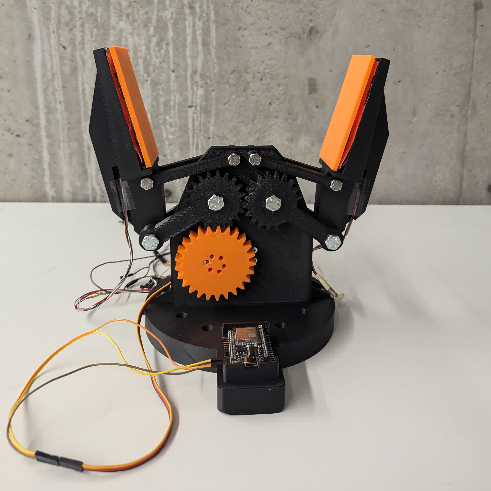
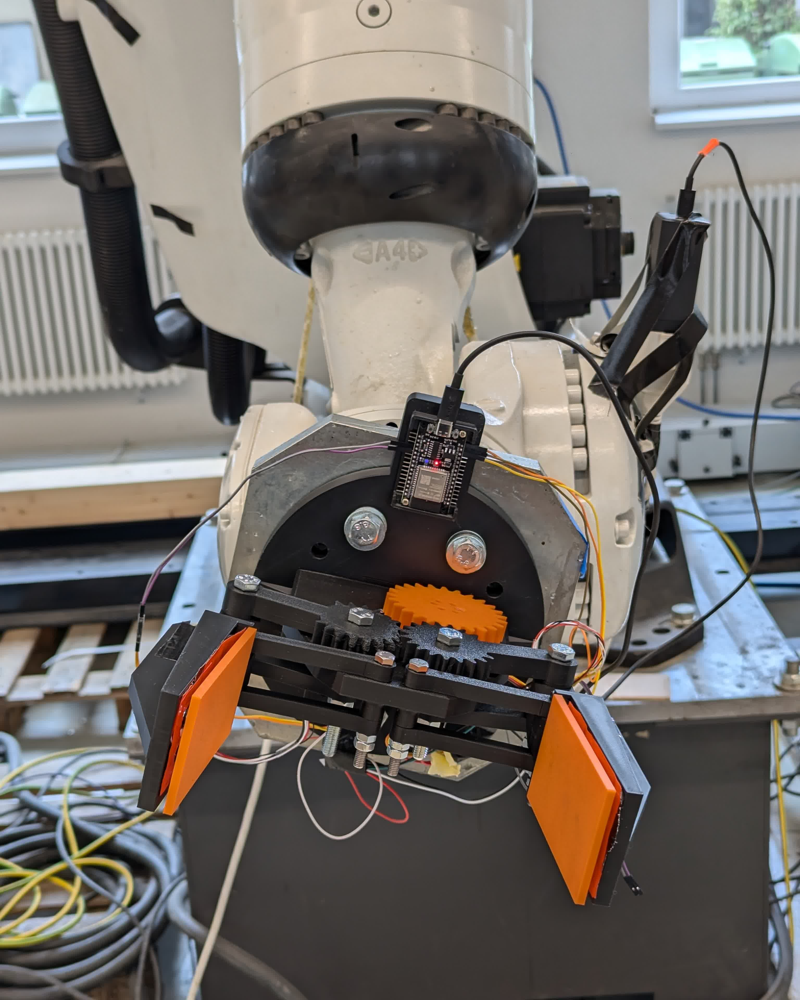

# FlexiSleeve
## A Haptic-Feedback Wearable Interface for Intuitive KUKA Robot Teleoperation



## Overview

**FlexiSleeve** is a robotic control system that bridges the gap between human intuition and industrial automation.

Standard robotic interfaces can be counter-intuitive and lack tactile response. This project addresses this by creating a synchronized system where the robot not only follows the human operator but provides **haptic feedback** (vibration) when the gripper encounters resistance.

The system is composed of three synchronized modules:

- **The Wearable Sleeve** captures arm orientation and finger bending.
- **The Intelligent Gripper** executes commands and senses gripping pressure.
- **The Computational Bridge** translates sensor data into real-time KUKA robot commands.

---

## Project Context

This project was developed as part of the **Computational Design and Digital Fabrication** seminar in the **ITECH M.Sc. program** at the **University of Stuttgart**.

### Team Members
- Pouria Shahhoseini Nia
- Yu-Lun Chiu
- Jonas Gorges

---

## Concept

### Human-Robot Synchronization

The core concept relies on a "Feedback Loop." The user controls the robot via natural arm movements, and the robot communicates back via vibration, creating a sense of touch over a distance.



### Control Modes

The system features three distinct operation modes, toggleable via an onboard button on the sleeve:

| Mode | Indication | Function |
|---|---|---|
| **1. Translation** | LED 1 | Controls the robot's **X, Y, Z** position in space. |
| **2. Rotation** | LED 2 | Controls the robot's **A, B, C** orientation (Tool Rotation). |
| **3. Neutral** | LED 3 | Locks movement to prevent accidental commands. |

### System Logic

#### The Sleeve (Transmitter)
- Reads the user's arm pitch, roll, and yaw via MPU6050.
- Detects index finger bending for gripping.
- Activates a vibration motor when the remote gripper detects force.

#### The Gripper (Receiver)
- Receives normalized flex data via WebSockets.
- Maps inputs to servo angles (0-95°).
- Uses a load cell to measure gripping pressure.


---

## System Architecture

### Signal Processing
- **ESP32 Microcontrollers** handle sensor reading and WebSocket communication.
- **Python Middleware** (`FlexiSleeve_MotionControl.py`) filters sensor noise using a Moving Average Filter.
- **KUKA Robot** runs a continuous loop (`FlexiSleeve_SRC.src`) to update its position variable (`MyPosSimon`).

### Orientation Logic
- **Wearable:** Raw IMU data -> Filtered Data -> JSON Packet.
- **Robot:** JSON Packet -> KRL Cartesian/Angular Coordinates -> Physical Movement.

---

## Hardware Requirements

### Electronics
- ESP32-WROOM x2
- MPU6050 (6-Axis IMU)
- Flex Sensors
- Servo Motor
- HX711 Load Cell Amplifier + Load Cell
- Vibration Motor
- Buttons & LEDs
- 220Ω Resistors
- Breadboards & Jumper Wires

### Robot Platform
- KUKA KR Series Industrial Robot
- KUKAVARPROXY (Server installed on robot controller)

---

## Robot Construction

The hardware consists of the wearable unit and the custom end-effector.

### Custom End-Effector


- 3D printed housing
- Servo-driven mechanism
- Integrated force sensing (Load Cell)

### Robot Integration


- Mounted to the KUKA flange
- Calibrated Tool Center Point (TCP)
- Wireless communication with the control PC

---

## Code Documentation

Detailed explanations of the project logic are provided in:

**Project Description_ FlexiSleeve.pdf** Located in the `docs` folder.

This document explains:
- The communication workflow between ESP32, Python, and KUKA
- The feedback loop logic
- Hardware prototype details

**Tool_Calibration.txt** Located in the `docs` folder (Contains TCP Offset Data).

---

## Software Setup

### Dependencies
- Arduino IDE (with `WebSocketsServer`, `ArduinoJson`, `MPU6050`, `HX711` libraries)
- Python 3.x (with `py_openshowvar`, `websocket-client`)
- KUKA Robot Controller

---

## Running the Project

### 1. Upload Firmware
- Upload `FlexiSleeve_Code.ino` to the Sleeve ESP32 (Update WiFi credentials).
- Upload `FlexiSleeve_Gripper_Code.ino` to the Gripper ESP32.

### 2. Robot Configuration
- Transfer `FlexiSleeve_SRC.src` to the KUKA controller.
- Configure **Tool 13** using the data in `docs/Tool_Calibration.txt`.

### 3. Start the Bridge
- Navigate to `src/Motion_Control` on your PC.
- Run the middleware script:
  ```bash
  python FlexiSleeve_MotionControl.py

### 4. Operation
- Toggle the mode button on the sleeve to unlock the robot.
- Move your arm to control the robot in real-time.
- Squeeze your finger to close the gripper.

---

## Media and Documentation

All media files are located in the `assets` folder:
- High-resolution renders
- System diagrams
- Demonstration videos

**FlexiSleeve_Test-No_2.mp4** (Full KUKA Test Video)

---

## Acknowledgements

Developed within the **ITECH M.Sc. program** at the **University of Stuttgart**,  
as part of the **Computational Design and Digital Fabrication** seminar.

---

## License

This project is intended for academic and educational use.  
Please credit the authors and the ITECH program when reusing or extending this work.